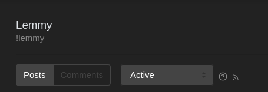

# lemmeme
A Discord Bot which fetches memes from lemmy! Made with [discord.py](https://github.com/Rapptz/discord.py).

## Key features
- Caches memes every 15 minutes from lemmy into RAM, no disk writes involved.
- Low memory footprint, and low web queries to lemmy.
- Uses the lemmy RSS feed for fetching memes, no login required.

## Self hosting
- Get [Docker](https://www.docker.com/)
- Clone this repository.
- Set your bot's token in [token.env](/token.env)
- Run `docker-compose up -d` to build and run the bot's container.

### Adding custom meme upstreams

- Copy the URL from the RSS feed button(the little button that looks like a WiFi icon). Example: `https://programming.dev/feeds/c/programmer_humor.xml?sort=Active`
- Remove the sort algorithm from the URL, and paste it into the [config.json](/config.json). For example in this case you will paste `https://programming.dev/feeds/c/programmer_humor.xml?sort=`

## Roadmap:
- [x] Add a simple way for bot administrators to add custom meme upstreams.
- [ ] Fix posts without images appearing in the meme command.
- [ ] Improve readability of the code.
